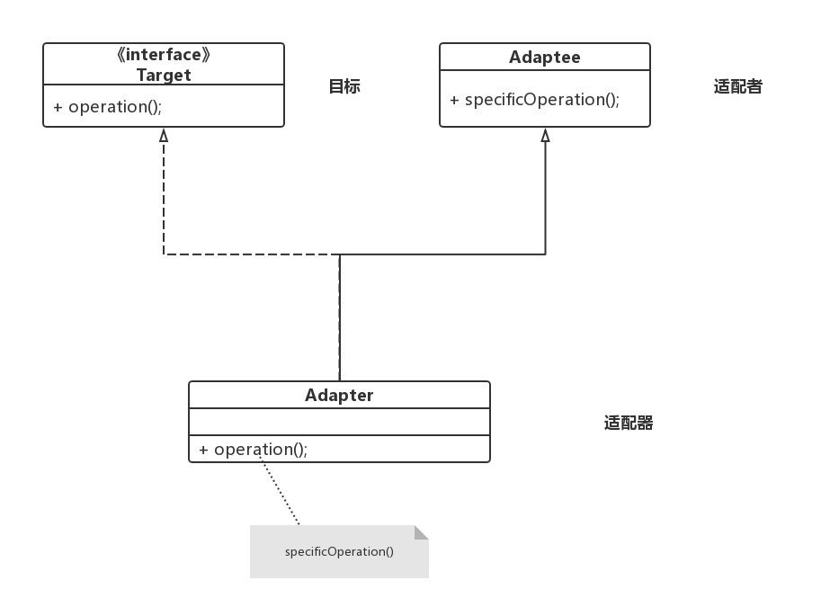

## 适配器模式

适配器模式（Adapter Pattern）是作为两个不兼容的接口之间的桥梁。这种类型的设计模式属于结构型模式，它结合了两个独立接口的功能。
这种模式涉及到一个单一的类，该类负责加入独立的或不兼容的接口功能。

适配器模式分为类适配器模式和接口适配器模式。
类适配器模式:

因为java没有类多继承，所以只能实现Target接口，而且Target只能是接口。Adapter实现了Target接口，继承了Adaptee类，Target.operation()实现为Adaptee.specificOperation()。
对象适配器模式:


在第三方接口对接过程中，可能会遇到多家接口不一致，而以相同的形式保存的情况，可以使用适配器模式:
```java
public interface ReturnA {
	List<EntityA> getConfirmDatasA(String startDate, String endDate);
}
public class ReturnB {
	List<EntityB> getConfirmDatasB(String startDate, String endDate) {
	   .....
	}
}
public class ReturnBAdapter implements ReturnA {
	List<EntityA> getConfirmDatasA(String startDate, String endDate) {
		return transferBToA(getConfirmDatasB(startDate, endDate));
	}
}
public class TestService {
	ReturnA[] returnAs = {returnAImpl, new ReturnBAdapter()};
	public static void main(String[] args) {
		returnAs.forEach(r -> save(r.getConfirmDatasA("someDay", "anotherDate")));
	}
}
```
上方是一段伪代码，想将新加入的三方接口和原有的接口一起调用保存，可以使用Adapter。