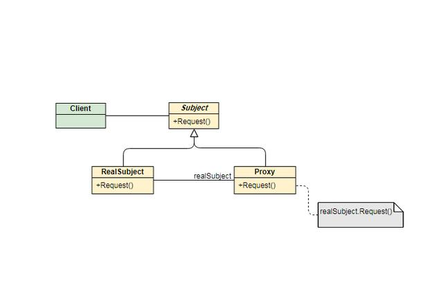

## 代理模式

代理模式：代理模式又叫委托模式，是为某个对象提供一个代理对象，并且由代理对象控制对原对象的访问。代理模式通俗来讲就是我们生活中常见的中介。
代理模式可以提供非常好的访问控制，应用比较广泛。

通过和被代理类继承同一个接口，可以在保证被代理类方法逻辑不变的情况下，在方法前后添加相应的业务逻辑。在调用父接口的客户类中，也不会察觉接口的变化。

### 静态代理模式

如statics目录下展示的那样，Worker属于IStaff，每个月有了收入后，就可以按照收入分配自己的开支。
若需要为收入增加税收规则：
侵入性较强的写法可以在receiveWages中插入税收的逻辑，但这样的写法直接在原有类上做了修改，会导致以下问题:
1. 不符合开闭原则，需要将税收逻辑嵌入原有业务逻辑，可能导致业务逻辑复杂。
2. 如果有其他需要添加税收逻辑的工作人员，需要一一添加。

### 动态代理模式

而像统计方法执行时间，添加事务等可能在许多方法前后执行。如果使用静态方法模式，需要重复的创建Proxy类，并重写不同方法只为了在前后加上相同的逻辑。此时可以使用动态代理模式。

动态代理模式分为JDK动态代理和CGLIB动态代理。

#### JDK动态代理

JDK动态代理需要新建一个Handler类实现InvocationHandler接口。实现invoke方法并在其中添加处理逻辑。被代理类的逻辑通过使用参数method.invoke来调用。

如dynamics.jdk中所示，MethodSpendTimeHandler实现了统计方法执行时间的功能，比起静态代理模式，在出现多个不同需要被代理的接口时，不需要创建多个Proxy实现类。在出现一个接口有多个方法被代理时，不需要在每个方法上添加代理逻辑。

调用动态代理时，将对象 使用Proxy.newProxyInstance，将原类及父接口和加载后的handler传入，即可得到Proxy类。

newProxyInstance中，会调用getProxyClass获取代理类字节码，然后通过代理类的newInstance把自己定义的InvocationHandler传入。
getProxyClass中，会使用ProxyGenerator的generateProxyClass方法生成字节码文件，并将该代理类放入WeakCache中。在下次调用getProxyClass时，如果WeakCache中缓存了，就直接使用即可。

#### CGLIB动态代理

CGLIB动态代理需要使用cglib和asm依赖包。新建一个Interceptor实现MethodInterceptor接口，实现interceptor方法并在其中添加处理逻辑。被代理类的逻辑通过methodProxy.invoke或methodProxy.invokeSuper来实现，invokeSuper和invoke的区别在于如果有其他代理类，invokeSuper会进行调用。

调用CGLIB动态代理时，新建Enhancer对象，通过set方法将代理拦截器和被代理类设置进去，然后调用enhancer.create()即可创建对应类的代理类。

CGLIB在执行时会添加代理类的class文件，添加到MethodProxy的FastClassInfo.FastClass中，在调用Method的invoke方法时，实际上是调用代理类FastClass的invoke方法。

#### CGLIB和JDK 动态代理的区别

1. Java动态代理只能够对接口进行代理，不能对普通的类进行代理（因为所有生成的代理类的父类为Proxy，Java类继承机制不允许多重继承）；CGLIB能够代理普通类；
2. Java动态代理使用Java原生的反射API进行操作，在生成类上比较高效；CGLIB使用ASM框架直接对字节码进行操作，在类的执行过程中比较高效。
3. CGLIB大部分类是直接对Java字节码进行操作，这样生成的类会在Java的永久堆中。如果动态代理操作过多，容易造成永久堆满，触发OutOfMemory异常。
