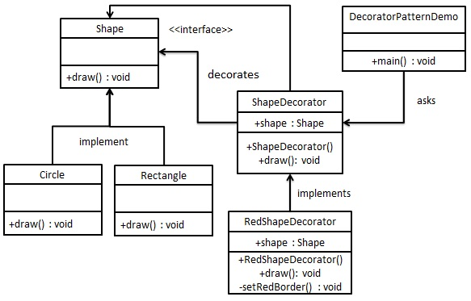

## 装饰器模式

装饰器模式（Decorator Pattern）允许向一个现有的对象添加新的功能，同时又不改变其结构。这种类型的设计模式属于结构型模式，它是作为现有的类的一个包装。

这种模式创建了一个装饰类，用来包装原有的类，并在保持类方法签名完整性的前提下，提供了额外的功能。

装饰器模式可以通过装饰类对原有逻辑进行扩充，也可以增加新的行为。

### 优缺点

优点：装饰类和被装饰类可以独立发展，不会相互耦合，装饰模式是继承的一个替代模式，装饰模式可以动态扩展一个实现类的功能。

缺点：多层装饰比较复杂。

### 装饰器模式和代理模式的区别

1. 代理模式为已有的逻辑添加非相关逻辑，装饰器模式为原有逻辑进行扩充。
2. 代理模式一般不会新增方法给调用方，调用方不关心调用的是代理还是原有类。而装饰模式中，具体采取哪套装饰模式，需要调用方根据逻辑来判定。
3. 代理模式由于逻辑单一，如打印某日志，只需要一个日志类就可以了。而装饰者模式需要根据逻辑选择一个装饰类，所以一类装饰一般暴露一个接口，在使用时，选择使用一个实现类。