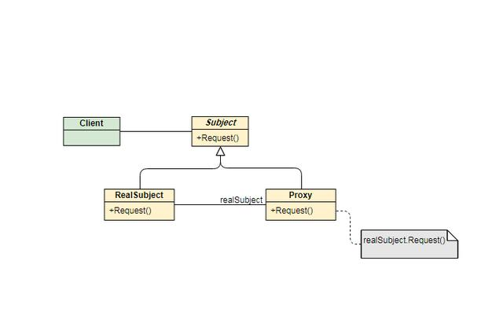

## 代理模式

代理模式：代理模式又叫委托模式，是为某个对象提供一个代理对象，并且由代理对象控制对原对象的访问。代理模式通俗来讲就是我们生活中常见的中介。
代理模式可以提供非常好的访问控制，应用比较广泛。

通过和被代理类继承同一个接口，可以在保证被代理类方法逻辑不变的情况下，在方法前后添加相应的业务逻辑。在调用父接口的客户类中，也不会察觉接口的变化。

### 静态代理模式

如statics目录下展示的那样，Worker属于IStaff，每个月有了收入后，就可以按照收入分配自己的开支。
若需要为收入增加税收规则：
侵入性较强的写法可以在receiveWages中插入税收的逻辑，但这样的写法直接在原有类上做了修改，会导致以下问题:
1. 不符合开闭原则，需要将税收逻辑嵌入原有业务逻辑，可能导致业务逻辑复杂。
2. 如果有其他需要添加税收逻辑的工作人员，需要一一添加。

### 动态代理模式

而像统计方法执行时间，添加事务等可能在许多方法前后执行。如果使用静态方法模式，需要重复的创建Proxy类，并重写不同方法只为了在前后加上相同的逻辑。此时可以使用动态代理模式。

动态代理模式分为JDK动态代理和CGLIB动态代理。

#### JDK动态代理

JDK动态代理需要新建一个Handler类继承InvocationHandler接口。实现invoke方法并在其中添加处理逻辑。被代理类的逻辑通过使用参数method.invoke来调用。
如dynamics.jdk中所示，MethodSpendTimeHandler实现了统计方法执行时间的功能，比起静态代理模式，在出现多个不同需要被代理的接口时，不需要创建多个Proxy实现类。在出现一个接口有多个方法被代理时，不需要在每个方法上添加代理逻辑。

