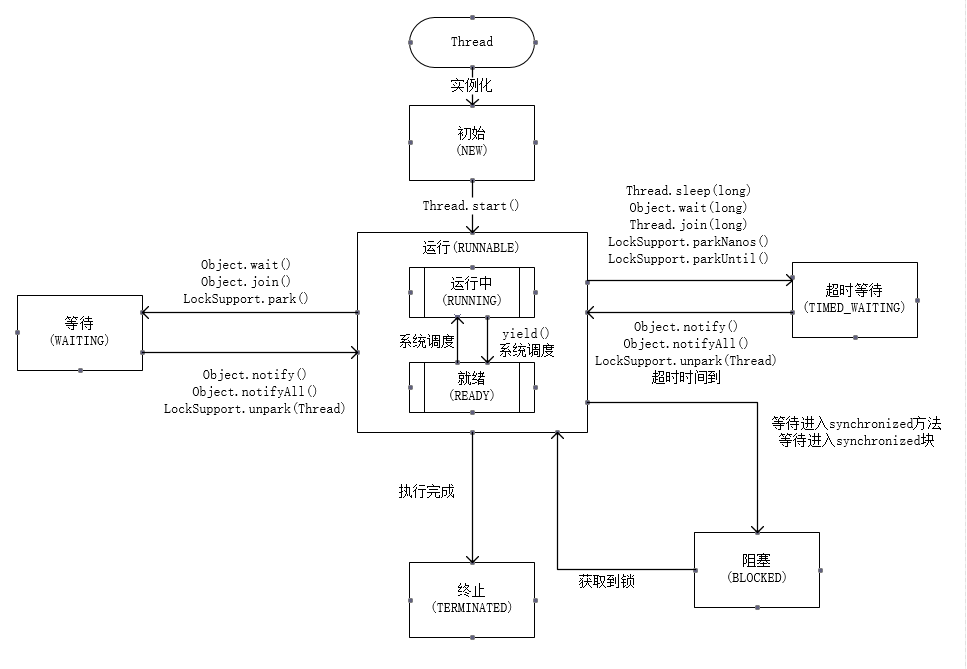

## 线程的状态

线程一共有6种状态。  
一个线程， 使用 new 或 newInstance 创建后， 进入 初始化状态。  
初始化后的线程，  调用 start() 方法 进入运行状态。  
运行状态的线程，有两个子状态，CPU调度的线程是运行中状态，非调度的线程是就绪状态。可以使用yield让运行中状态的线程变为就绪状态。  
运行状态的线程，调用wait和join方法没声明超时时间时，进入等待状态，在使用对应对象的notify或notifyAll方法后，才会回到运行状态。
运行状态的线程，调用wait和notify声明超时时间，或调用sleep方法时，进入超时等待状态，在使用对应对象的notify或notifyAll方法，或到达超时时间时，会回到运行状态。
运行状态的线程，在遇到synchronized锁住的方法或块，没获取到锁时，会进入BLOCKED状态，直到获取到锁，才会回到运行状态。
运行状态的线程，在执行完成run中的任务时，会进入终止状态。



执行ThreadState类，命令行输入jps，找到 ThreadState对应的进程id。输入 jstack 进程id。可以查看当前的线程状态如下:

``` java
"BlockedThread-2" #14 prio=5 os_prio=0 tid=0x000000001ea83800 nid=0x19d8 waiting
 for monitor entry [0x000000001fa0f000]
   java.lang.Thread.State: BLOCKED (on object monitor)
        at threadstatus.ThreadState$Blocked.run(ThreadState.java:47)
        - waiting to lock <0x000000076b4b0818> (a java.lang.Class for threadstat
us.ThreadState$Blocked)
        at java.lang.Thread.run(Thread.java:748)

"BlockedThread-1" #13 prio=5 os_prio=0 tid=0x000000001ea80800 nid=0xbd4 waiting
on condition [0x000000001f90e000]
   java.lang.Thread.State: TIMED_WAITING (sleeping)
        at java.lang.Thread.sleep(Native Method)
        at java.lang.Thread.sleep(Thread.java:340)
        at java.util.concurrent.TimeUnit.sleep(TimeUnit.java:386)
        at src.SleepUtils.second(SleepUtils.java:9)
        at threadstatus.ThreadState$Blocked.run(ThreadState.java:47)
        - locked <0x000000076b4b0818> (a java.lang.Class for threadstatus.Thread
State$Blocked)
        at java.lang.Thread.run(Thread.java:748)

"WaitingThread" #12 prio=5 os_prio=0 tid=0x000000001ea7b800 nid=0x564 in Object.
wait() [0x000000001f80e000]
   java.lang.Thread.State: WAITING (on object monitor)
        at java.lang.Object.wait(Native Method)
        - waiting on <0x000000076b4aec68> (a java.lang.Class for threadstatus.Th
readState$Waiting)
        at java.lang.Object.wait(Object.java:502)
        at threadstatus.ThreadState$Waiting.run(ThreadState.java:32)
        - locked <0x000000076b4aec68> (a java.lang.Class for threadstatus.Thread
State$Waiting)
        at java.lang.Thread.run(Thread.java:748)

"TimeWaitingThread" #11 prio=5 os_prio=0 tid=0x000000001ea79000 nid=0x1e14 waiti
ng on condition [0x000000001f70f000]
   java.lang.Thread.State: TIMED_WAITING (sleeping)
        at java.lang.Thread.sleep(Native Method)
        at java.lang.Thread.sleep(Thread.java:340)
        at java.util.concurrent.TimeUnit.sleep(TimeUnit.java:386)
        at src.SleepUtils.second(SleepUtils.java:9)
        at threadstatus.ThreadState$TimeWaiting.run(ThreadState.java:20)
        at java.lang.Thread.run(Thread.java:748)
```

可以看到，TimeWaiting线程，由于run方法进入了sleep方法，进入100毫秒的TIME_WAIT状态，100毫秒的等待后，由于超时进入运行状态，经过极短的判断后，再次回到TIME_WAIT状态  
Waiting线程进入wait()方法后，会一直卡在WAIT状态。
Block1线程进入和TimeWaiting 一样的超时等待状态。
Block2线程进入run方法时，由于Blocked类的锁已经被Block1持有，所以进入Block状态。  
  

  