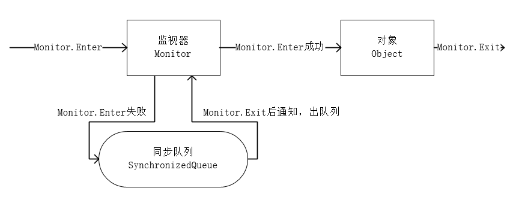

## synchronized

synchronized 对于同步块的实现使用了 monitorenter 和 monitorexit 指令。
而同步方法则是依靠方法修饰符上的ACC_SYNCHRONIZED 来完成的。  
无论采用哪种方式，其本质是对一个对象的监视器(monitor)进行获取，而这个获取过程是排他的，也就是同一时刻只能有一个线程获取到由synchronized所保护对象的监视器。

任意一个对象都拥有自己的监视器，当这个对象由同步块或者这个对象的同步方法调用时，执行方法的线程必须先获取到该对象的监视器才能进入同步块或者同步方法。
而没有获取到监视器(执行该方法)的线程将会被阻塞在同步块和同步方法的入口处，进入BLOCKED状态。



任意线程对Object(Object 由 synchronized保护) 的访问， 首先要获得Object的监视器。如果获取失败，线程进入同步队列，线程状态变为BLOCKED。
当访问Object的前驱(获得了锁的线程)释放了锁，则该释放操作唤醒阻塞在同步队列中的线程，使其重新尝试对监视器的获取。

## 等待通知机制

一个线程修改了一个对象的值，而另一个线程感知到了变化，然后进行相应的操作，整个过程开始于一个线程，而最终执行又是另一个线程。
前者是生产者，后者就是消费者，这种模式隔离了"做什么"(what)和"怎么做"(how)，在功能层面上实现了解耦，体系结构上具备了良好的伸缩性。

Java中简单的实现方法如下:
```java
while (value != desire) {
    Thread.sleep(1000);
}
doSomething();
```

上面代码在条件不满足时会睡眠一段时间，这样做有以下问题:

1. 难以确保及时性

2. 难以降低开销

可以使用等待 / 通知 机制解决。

notify() 

通知一个在对象上等待的线程，使其从wait()方法返回，而返回的前提是该线程获取到了对象的锁。

notifyAll()

通知所有等待在该对象上的线程

wait()

调用该方法的线程进入WAITING状态 ，只有等待另外线程的通知或被中断才会返回，需要注意，调用wait()方法后，会释放对象的锁。

wait(long)

超时等待一段时间，这里的参数时间是毫秒，也就是等待长达 n 毫秒，如果没有通知就超时返回。

wait(long, int)

对于超时时间更细粒度的控制，可以达到纳秒

WaitNotify打印效果如下:

```
Thread[WaitThread,5,main]flag is true. wait@ 12:12:45
Thread[NotifyThread,5,main]hold lock. notify @12:12:46
Thread[NotifyThread,5,main] hold lock again. sleep@12:12:51
Thread[WaitThread,5,main] flag is false. running@ 12:12:56
```

1.使用wait()、notify() 和 notifyAll() 时需要先对调用对象加锁。  
2.调用wait()方法后，线程状态由RUNNING变为WAITING，并将当前线程放置到对象的等待队列。  
3.notify()或notifyAll()方法调用后，等待线程依旧不会从wait()返回，需要调用notify()或notifyAll()的线程释放锁之后，等待线程才有机会从wait() 返回。  
4.notify()方法将等待队列中的一个等待线程从等待队列中移到同步队列中，而notifyAll()方法则是将等待队列中所有的线程全部移到同步队列。

### 等待 / 通知的经典范式

```
synchronized(对象) {
    while (条件不满足) {
        对象.wait();
    }
    对应的处理逻辑
}

synchronized(对象) {
    改变条件
    对象.notifyAll();
}
```

等待方遵循如下原则:
1.获取对象的锁。
2.如果条件不满足，那么调用对象的wait()方法，被通知后仍要检查条件。
3.条件满足则执行对应的逻辑。

通知方遵循如下原则:
1.获得对象的锁。
2.改变条件。
3.通知所有等待在对象上的线程。

Q: 为什么要在有wait的情况下加循环  
A: 防止被其他逻辑错误唤醒后执行